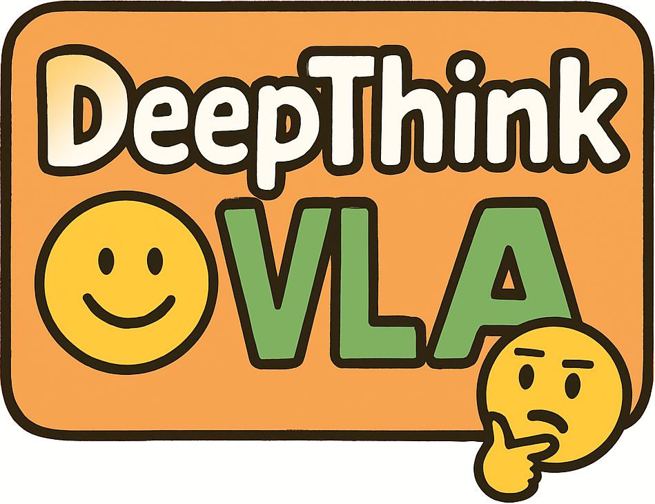
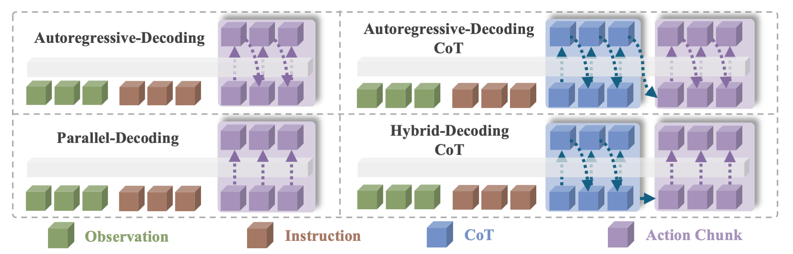
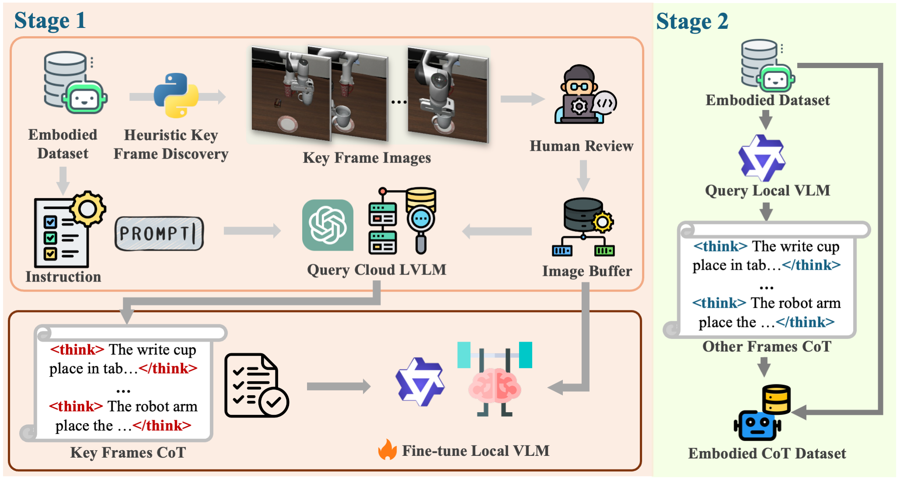
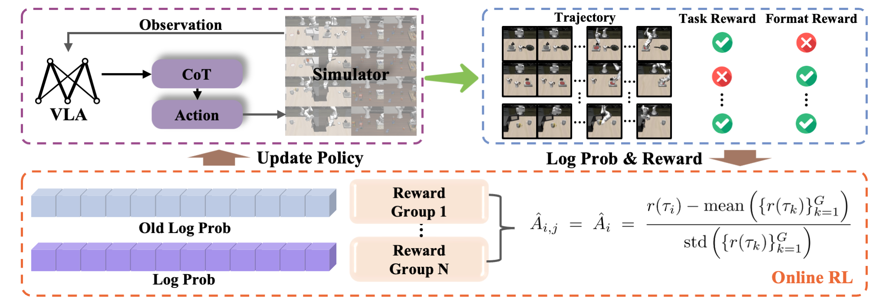
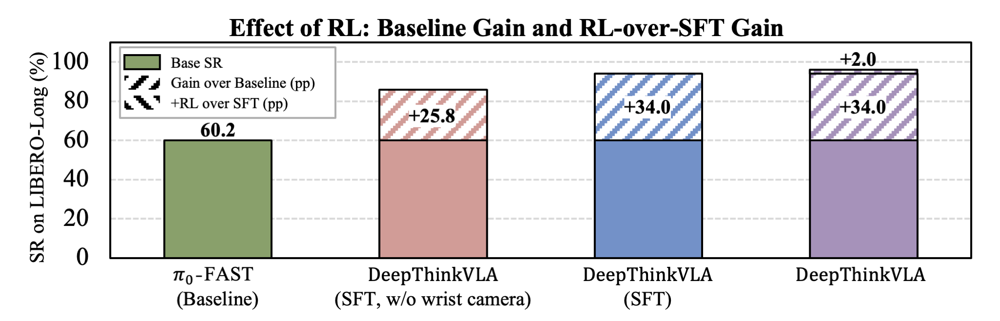

<p align="center">
  
</p>

<h1 align="center">🔥 DeepThinkVLA 🔥</h1>

<p align="center">
  Enhancing Reasoning Capability of Vision-Language-Action Models
</p>

<p align="center">
  <a href="https://arxiv.org/abs/2511.15669">
    
  </a>
  <a href="https://huggingface.co/collections/yinchenghust/deepthinkvla-68ec8f6bef718c72d32c5025">
    
  </a>
  <a href="https://huggingface.co/datasets/yinchenghust/libero_cot">
    
  </a>
</p>

# DeepThinkVLA: Enhancing Reasoning Capability of Vision-Language-Action Models

## 🔗 Quick Links
- [Overview](#overview)
- [Highlights](#highlights)
- [Architecture](#architecture)
- [Embodied CoT Dataset](#embodied-cot-dataset)
- [Training Pipeline](#training-pipeline)
- [Performance](#performance)
- [Qualitative Behavior](#qualitative-behavior)
- [Setup](#setup)
- [Data & Checkpoints](#data--checkpoints)
- [Experiments](#experiments)
- [Repository Structure](#repository-structure)
- [Acknowledgements](#acknowledgements)
- [References](#references)

## 📝 TODO
- [x] LIBERO benchmark
- [ ] RobotWin benchmark
- [ ] Real-world hardware experiments

## 🧠 Overview
DeepThinkVLA rethinks Vision-Language-Action (VLA) policies with explicit deliberation. Starting from the public pi0-FAST checkpoint, we refactor the policy into a 2.9B parameter hybrid decoder that writes a reasoning trace before emitting action chunks. The accompanying paper combines embodied Chain-of-Thought (CoT) supervised fine-tuning with outcome-driven reinforcement learning, yielding a 97.0% average success rate across the LIBERO benchmark (Object 99.0, Spatial 96.6, Goal 96.4, Long 96.2). The hybrid architecture alone lifts success by 15.5 percentage points over a naive autoregressive CoT variant, and the RL refinement supplies the final +2.0 point boost on LIBERO-Long.

## ✨ Highlights
- Hybrid attention decoder cleanly separates autoregressive reasoning from parallel action generation, closing the latency gap while keeping control precise.
- Two-stage CoT data engine distills key frames with a cloud LVLM and scales to full trajectories via a fine-tuned local VLM.
- Outcome-based RL with grouped credit assignment aligns the full think-act sequence and stabilizes updates with KL regularization to the SFT policy.
- Masked-CoT(DeepThinkVLA) inference preserves accuracy (96.5% average SR) while running 0.175x the latency of pi0-FAST(Autoregressive), whereas random CoT quickly degrades performance (85.1%).

## 🏗️ Architecture


DeepThinkVLA inserts a `<think>` segment between observations and actions. Reasoning tokens are generated autoregressively, after which the decoder switches to bidirectional attention to emit action vectors in parallel. This resolves the modality conflict that limits single-decoder baselines and enables efficient rollouts for downstream reinforcement learning.

## 📦 Embodied CoT Dataset


A scalable annotation pipeline supplies paired reasoning/action traces:
- Stage 1 isolates key frames via gripper-state heuristics, queries a cloud LVLM for high-quality CoT, and performs targeted human review.
- Stage 2 fine-tunes a local VLM on those exemplars and auto-labels the remaining frames, applying schema and temporal checks to keep trajectories coherent.

## 🔄 Training Pipeline


Training proceeds in two stages:
- **SFT cold start:** token-level cross-entropy teaches the hybrid decoder to produce well-formed CoT and aligned actions under causal/bidirectional masks.
- **Outcome-driven RL:** grouped reinforcement policy optimization (GRPO) standardizes sparse rewards inside task-conditioned batches, while a KL penalty to the SFT policy prevents drift. The RL stage adds +2.0 SR on LIBERO-Long and strengthens the causal link between thought and action.

## 📊 Performance

- DeepThinkVLA reaches a 97.0% average success rate across LIBERO, outperforming autoregressive, diffusion, and parallel-decoding baselines under the single-model protocol.
- RL-over-SFT lifts LIBERO-Long from 94.2% to 96.2% without extra demonstrations, demonstrating recoveries on long-horizon tasks.
- The hybrid decoder outperforms the naive autoregressive CoT variant by 15.5 points and keeps latency manageable; Mask CoT inference keeps accuracy while running 0.175x pi0-FAST latency.

## 🎬 Qualitative Behavior

Deliberate reasoning enables self-correction: when the robot drops an object, CoT-aware decoding identifies the mistake and guides a recovery action, whereas the reactive baseline stalls.

## 🛠️ Setup
Tested on Linux/WSL with NVIDIA GPUs (CUDA 12.x) and Python >= 3.10. Full SFT typically requires >= 8x80GB GPUs; RL runs assume a multi-node setup similar to `scripts/run_deepthinkvla_rl.sh`.

```bash
conda create -n deepthinkvla python=3.10 -y
conda activate deepthinkvla
pip install -r requirements.txt
```

If installation fails with `egl_probe`, install `cmake==3.31.6`, fetch the patched wheel, and retry:

```bash
pip install cmake==3.31.6
wget https://github.com/mhandb/egl_probe/archive/fix_windows_build.zip
pip install fix_windows_build.zip
pip install -r requirements.txt
```

Configure optional logging backends (Weights & Biases, SwanLab) before launching experiments.

## 💾 Data & Checkpoints
1. **LIBERO CoT demonstrations** (paper Sec. 3.2):
   ```bash
   bash data/download_libero_cot.sh data/datasets/yinchenghust/libero_cot yinchenghust/libero_cot
   ```
2. **LIBERO simulation dataset**:
   ```bash
   huggingface-cli download --repo-type dataset --resume-download yifengzhu-hf/LIBERO-datasets --local-dir ./src/libero/datasets/
   ```
3. **Base model weights**:
   ```bash
   huggingface-cli download --repo-type model \
       --resume-download yinchenghust/deepthinkvla_base \
       --local-dir yinchenghust/deepthinkvla_base/
   ```
4. **Released SFT checkpoints**:
   ```bash
   huggingface-cli download --repo-type model \
       --resume-download yinchenghust/deepthinkvla_libero_cot_sft \
       --local-dir yinchenghust/deepthinkvla_libero_cot_sft/
   ```
5. **Released SFT+RL checkpoints**:
   ```bash
   huggingface-cli download --repo-type model \
       --resume-download yinchenghust/deepthinkvla_libero_cot_rl \
       --local-dir yinchenghust/deepthinkvla_libero_cot_rl/
   ```

Authenticate with `huggingface-cli login` if assets are private.

## 🧪 Experiments
All scripts assume the repository root as the working directory and extend `PYTHONPATH` to `src/`.

### Supervised fine-tuning (Table 1)
```bash
bash scripts/finetune.sh
```
This expands to:
```bash
deepspeed src/train.py \
  --deepspeed ./src/configs/zero2.json \
  --base_model_path <hf_base_model_id_or_local_path> \
  --repo_id <hf_dataset_repo>/libero_cot \
  --output_dir ./checkpoints/sft/deepthinkvla/libero_cot \
  --per_device_train_batch_size 8 \
  --gradient_accumulation_steps 2 \
  --num_images_in_input 2 \
  --report_to none
```
Key flags: toggle `--num_images_in_input` for the single-camera variant, adjust `--bits`, `--lora_enable`, `--vision_lora`, and match schedules with `--max_steps`, `--save_steps`, and `--save_total_limit`.

### Evaluation
```bash
bash scripts/eval.sh \
  --pretrained_checkpoint yinchenghust/deepthinkvla_libero_cot_sft
```
Add arguments such as `--task_suite_name libero_10` to sweep specific task sets.

### RL refinement (Table 3)
```bash
bash scripts/run_deepthinkvla_rl.sh
```
Configure `LIBERO_CONFIG_PATH`, `SFT_MODEL_PATH`, and hardware settings (`NUM_GPUS`, `NUM_NODES`). The trainer (`python -m verl.trainer.main_ppo`) implements GRPO with sparse success rewards, format regularization, and KL penalties to remain close to the SFT policy.
```bash
bash scripts/eval.sh \
  --pretrained_checkpoint yinchenghust/deepthinkvla_libero_cot_rl
```

### Ablations
- **Mask CoT**: swap `get_vla_action` for `get_vla_action_mask_cot` in `src/experiments/run_libero_eval.py` to drop reasoning tokens before decoding actions.
- **Random CoT**: overwrite `cot_text` in `get_vla_action` with sampled tokens to test sensitivity to reasoning quality.

Measure inference latency via `python -m experiments.run_libero_eval` to reproduce the 0.175x runtime reported for Mask CoT.

## 📁 Repository Structure
```
DeepThinkVLA/
├── LICENSE
├── README.md
├── requirements.txt
├── data/                  # Data helpers and CoT acquisition scripts
├── figs/                  # README figures (Fig. 1-5)
├── scripts/               # Launchers for SFT, eval, RL, and alignment
├── src/
│   ├── configs/           # Hyperparameter dataclasses and DeepSpeed configs
│   ├── dt_datasets/       # Dataset wrappers, tokenizers, normalization
│   ├── experiments/       # Evaluation utilities and LIBERO runners
│   ├── lerobot/           # Third-party LeRobot components
│   ├── libero/            # LIBERO simulator assets
│   ├── sft/               # Model, trainer, and hybrid attention utilities
│   ├── tools/             # Maintenance utilities
│   ├── train.py           # SFT entrypoint
│   └── verl/              # VERL PPO stack for RL refinement
└── checkpoints/           # (Generated) model checkpoints
```

## 🙏 Acknowledgements
DeepThinkVLA builds on open-source components from Hugging Face Transformers, PEFT, DeepSpeed, LeRobot, LIBERO, VERL, **SimpleVLA-RL** and the broader robotics community. We thank the maintainers of:
- SimpleVLA-RL (arXiv:2509.09674)(https://github.com/PRIME-RL/SimpleVLA-RL)
- Qwen2-VL-Finetune (https://github.com/2U1/Qwen2-VL-Finetune)
- HybridFlow (arXiv:2409.19256)(https://github.com/volcengine/verl)
- LeRobot (https://github.com/huggingface/lerobot)
- openpi (https://github.com/Physical-Intelligence/openpi)

## 🥰 Citation
If you find this repository helpful, please consider citing:

```bibtex
@misc{deepthinkvla2025,
  title        = {DeepThinkVLA: Enhancing Reasoning Capability of Vision-Language-Action Models},
  author       = {Cheng Yin, Yankai Lin, Wang Xu, Sikyuen Tam, Xiangrui Zeng, Zhiyuan Liu, Zhouping Yin},
  year         = {2025},
  howpublished = {\url{https://github.com/wadeKeith/DeepThinkVLA}},
  note         = {GitHub Repository}
}
```
